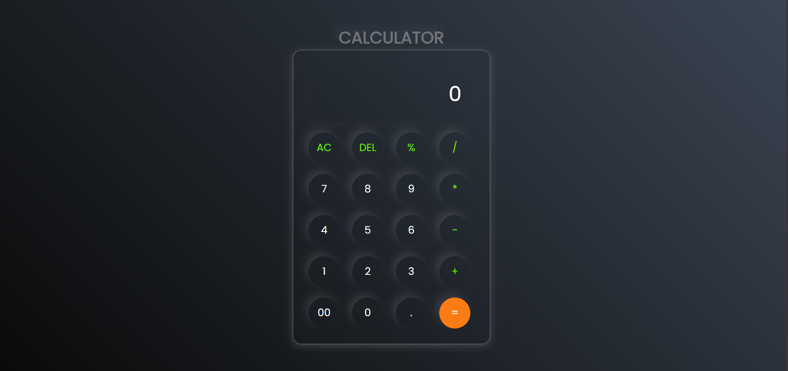

# 🧮 Calculator App

A **clean, responsive, and minimal Calculator** built with pure **HTML, CSS, and JavaScript** — featuring a sleek glassmorphism + neumorphism dark UI.

> 🔗 **Live Demo:** [calculator-app-liard-six.vercel.app](https://calculator-app-liard-six.vercel.app/)

---

## 📸 Preview



---

## ✨ Features

- ➕ Basic arithmetic — Addition, Subtraction, Multiplication, Division
- 🔢 Double-zero (`00`) and decimal (`.`) support
- 🔄 **AC** — Clears the entire input
- ⌫ **DEL** — Deletes the last character
- 📱 Fully responsive — works on mobile & desktop
- 🎨 Dark glassmorphism UI with glowing neumorphic buttons

---

## 🛠️ Tech Stack

| Technology | Purpose |
|------------|---------|
| HTML5 | App structure & layout |
| CSS3 | Styling, gradients, shadows |
| JavaScript (ES6) | Button logic & DOM manipulation |

---

## 📂 Project Structure

```
calculator-project/
│
├── index.html              # Main HTML file
├── style.css               # Styles (glassmorphism + neumorphism)
├── script.js               # Calculator logic
├── assets/
│   └── calculator-preview.png
└── README.md
```

---

## 🚀 Getting Started

```bash
# 1. Clone the repository
git clone https://github.com/your-username/calculator-project.git

# 2. Navigate into the directory
cd calculator-project

# 3. Open in your browser
open index.html
```

No build tools, no dependencies — just open and run. ✅

---

## ⚙️ How It Works

1. Every button click appends its value to a running `string`
2. Pressing `=` evaluates the expression using JavaScript's `eval()`
3. `AC` resets the string to empty
4. `DEL` slices off the last character using `substring()`
5. The result is dynamically rendered in the `<input>` display field

---

## ⚠️ Known Issues / Limitations

| Issue | Details |
|-------|---------|
| `%` button | Not yet functional — no logic in `script.js` |
| `eval()` usage | Works for demos, but unsafe for production apps |
| No keyboard support | Only mouse/touch input currently supported |
| No error handling | Malformed expressions will crash silently |

---

## 🔮 Planned Improvements

- [ ] Fix `%` (modulo/percentage) operator logic
- [ ] Add keyboard input support
- [ ] Replace `eval()` with a safe expression parser
- [ ] Add error handling for invalid expressions (e.g. `5//2`, `*/`)
- [ ] 🌙 Dark / Light mode toggle
- [ ] Advanced operations: `√`, `x²`, `±`
- [ ] Calculation history panel

---

## 🤝 Contributing

Contributions, issues, and feature requests are welcome!

1. Fork the repository
2. Create a new branch: `git checkout -b feature/your-feature`
3. Commit your changes: `git commit -m 'Add some feature'`
4. Push to the branch: `git push origin feature/your-feature`
5. Open a Pull Request

---

## 📄 License

This project is licensed under the **MIT License** — feel free to use and modify it.

---

## 👤 Author

**Rahul Kumar**

- 🐙 GitHub: [github.com/your-username](https://github.com/your-username)
- 💼 LinkedIn: [linkedin.com/in/your-profile](https://linkedin.com/in/your-profile)

---

⭐ Found it useful? **Star the repo** to show some love!
